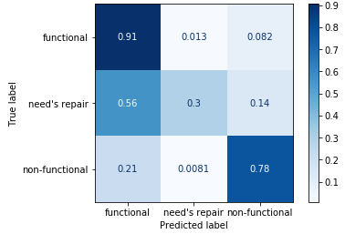
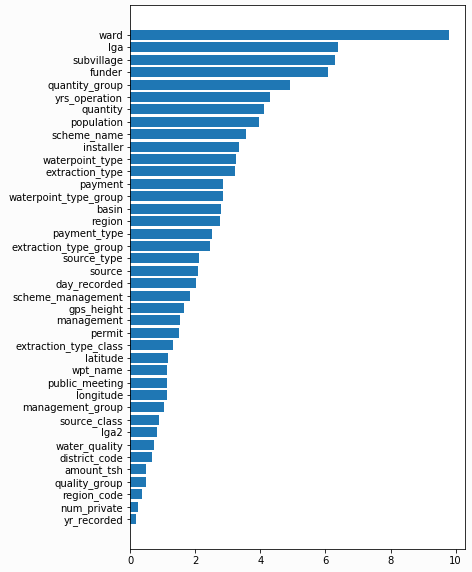
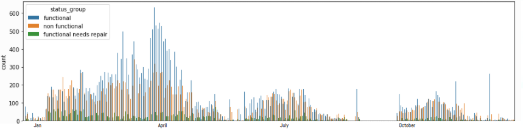

# Phase3_Project
Driven Data competition> Pump it up: Data Mining the Water Table     
Tanzanian Water Well competition    
    
## Task
From the data provided predict which wells are 'functional', 'in need of repair' or 'non-functional'    
    
## Cleaning:
There are a lot of similar columns -selected columns to drop.     
Imputed missing physical geographical data from location description data    
Set missing categorical features to 'unknown'     
Feature engineering -split date recorded into day of year and years of operation     
     
## Modelling
Ran many models with:     
- different hyperparameters    
- with/without standard scalar    
- dropping different amounts of infrequent categories    
  - Or target encoding    
  
## Conclusion    
Best model: CatBoost with a prediction accuracy on the test set of 81%    
-accuracy is the metric used by the competition     
    
     

The most important features were about the well's location. It makes sense that wells fed by the same source would dry up together However there was also some association between location and date recorded so wells near each other are more likely to be recorded in the same wet or dry season     
     
     
If the whole project were to be done again I would ask of the data collectors to include seasonally functional as separate class I would also ask them, if possible, to find the year a well became non-functional, which could turn this into more of a regression problem -how long does the well pump last?    
   

## Future Work
With more time I’d like to:    
Try using SMOTE on the smallest class     
-Though I suspect it would have been detrimental to the overall accuracy    
     
Carry out further hyperparameter tuning in XGBoost and the Support Vector Classifier    
Also, having all these models, I’d like to try using bagging methods with them to create an ensemble    
     
With more time still:     
I’d go back and try using CatBoost to impute missing values in the original data    
And also try H2O as another algorithm that can handle categories    
   
I'd also move functions to a separate file
